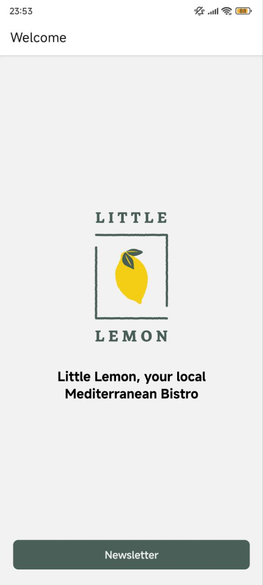
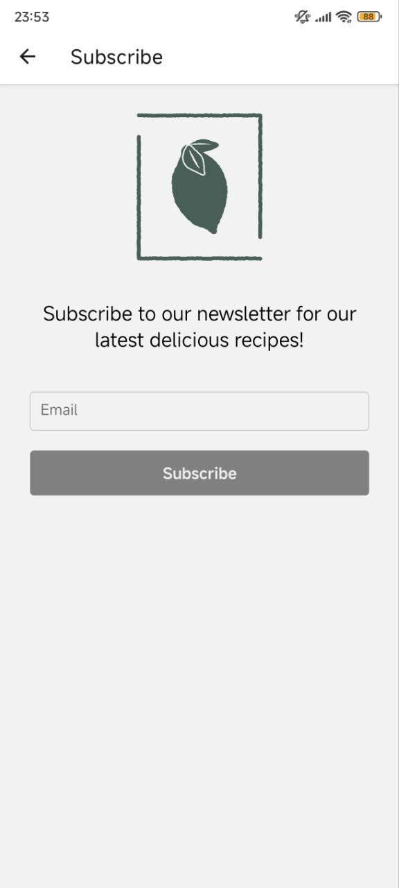
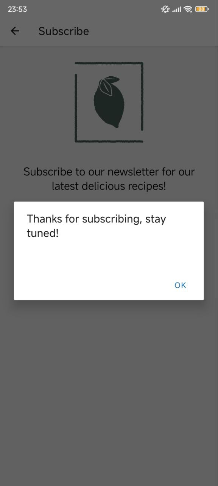

# 🍋 Little Lemon Newsletter Signup App

This project is the **final graded assessment** for the _React Native_ course. It demonstrates your ability to build a functional mobile app using **React Native**, **React Navigation**, and **Bun** as the JavaScript runtime.

---

## 🎯 Project Objective

Build a **newsletter sign-up application** for the Little Lemon restaurant that lets users:

- Navigate between a Welcome and a Subscribe screen
- Enter their email address
- Receive a confirmation message upon successful subscription

---

## 🧠 Learning Outcomes

Through this project, you demonstrate your ability to:

- Create multi-screen apps using **React Native**
- Set up and manage **stack navigation**
- Capture and validate **user input**
- Render content conditionally
- Organize and maintain clean project structure

---

## 🖼️ App Features

### 🟢 Welcome Screen

- Displays:
  - Little Lemon logo
  - Introductory message
  - A button that navigates to the Subscribe screen

### 📨 Subscribe Screen

- Includes:
  - An image and brief description
  - An input for the user to enter an email address
  - A submit button that is only **enabled when input is valid**
  - On submission, replaces the form with a **"Thank you"** message

---

## ⚙️ Tech Stack

- [React Native](https://reactnative.dev/)
- [Expo](https://expo.dev/)
- [React Navigation](https://reactnavigation.org/)
- [Bun](https://bun.sh/) (⚡️ fast alternative to Node.js)

---

## 📂 Project Structure

```
.
├── App.js                       # App entry point with navigation
├── index.js                    # Registers root component
├── app.json                    # Expo app configuration
├── bun.lock                    # Bun lockfile
├── package.json
├── assets/                     # Images and app assets
│   └── ...png
├── navigators/
│   └── RootNavigator.js        # Navigation setup
├── screens/
│   ├── WelcomeScreen.js
│   └── SubscribeScreen.js
├── utils/
│   └── index.js                # Helper functions
└── README.md
```

---

## 🚀 Getting Started

### 🧾 Prerequisites

- [Bun](https://bun.sh/docs/installation)
- [Expo CLI](https://docs.expo.dev/get-started/installation/)
- Mobile device with [Expo Go](https://expo.dev/client) installed **or** a mobile emulator

### 🛠️ Installation & Run

```bash
bun install
bun run start
```

> Scan the QR code with the Expo Go app to launch the project on your device.

---

## ✅ Assessment Checklist

- [x] Navigation between Welcome and Subscribe screens
- [x] Input field with basic email validation
- [x] Conditional rendering of the thank-you message
- [x] Uses React Native components and assets correctly
- [x] Organized and clean project structure

---

## 📸 Screenshots





---

## 📝 License

This project was built as a final assessment for the **Meta React Native Developer** course.  
Educational use only.
